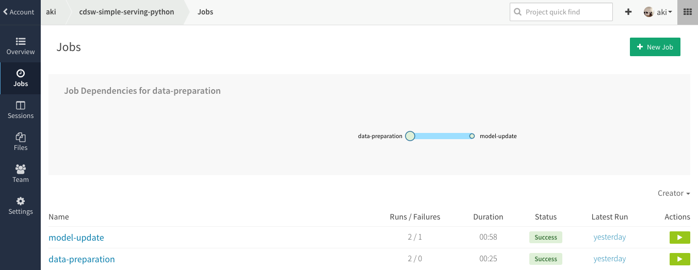

# cdsw-simple-serving-python



This is aim to Python version of [cdsw-simple-serving](https://github.com/srowen/cdsw-simple-serving).

This repo has:

- data preparation with RDD
- built a simple machine learning pipeline with Spark.ml
- export built model
- example web server code for scoring

Currently, this repo doesn't have following features:

- export built model as PMML

## requirements

`pip install -r requirements.txt`

## Set the environment variable

- `HDFS_HOST` for handling HDFS files via `hdfs` package

## You can use this repo for:

- as a template for collaboration with Data Engineer and Data Scientist
- crete job dependencies from data preparation to model serving

## How to run sample web app

1. Create virtualenv for your app: `virtualenv -p python2 venv && source ./venv/bin/activate`
2. Install dependent libraries: `pip install -r requirements-webapp.txt`
3. Run example app: `spark-submit serving/web_app.py`

then, you can POST data as follows:

```sh
$ curl -v -H "Accept: application/json" -H "Content-type: application/json" -X POST -d '{"Temperature":23.18,"Humidity":27.272,"Light":426,"CO2":721.25,"HumidityRatio":0.00478}' http://localhost:5000/api/predict
```

or, if you want to use `gunicorn`

1. `pip install -r requirements-webapp.txt`
2. Download spark repo
3. Install pyspark dependencies: `cd some-spark-director/python && pip install -e`
4. Run example app: `cd serving; gunicorn web_app:app --log-file -`